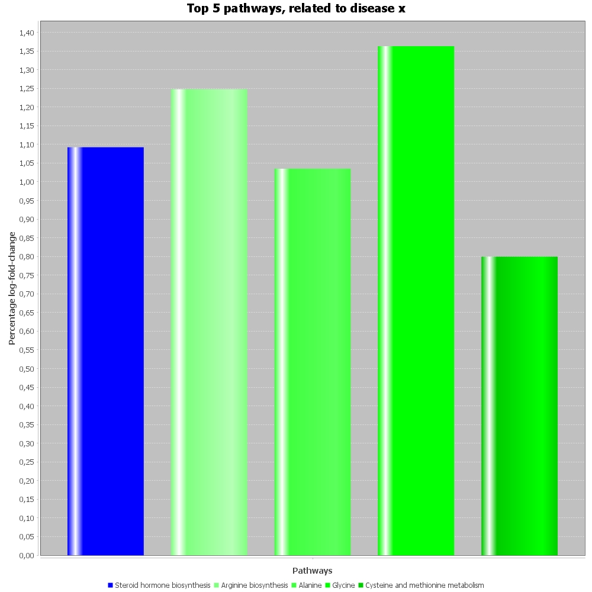

# DGSEA-tools

**DGSEA-tools** provide several tools to gain insights into gene-enrichment data as part of a differential gene set enrichment analysis.
Using results of this analysis tool you will be able to:
- Obtain count data on two aspects of differentially expressed genes (DEGs) for each pathway: presence in the pathway and significance presence.
- Compare enrichment scores between pathways using bar charts.
- Analyze the relationship between enrichment scores and p-values across pathways with dot charts.
- Compare the average log-fold change of DEGs among pathways using bar charts.


Differential gene set enrichment analysis relies on output data from differential gene expression analysis (DGEA), specifically in the form of log-fold change data and significance measured as p-values. This data can originate from count sequencing linked to genes, such as:

- [Microarray](https://www.genome.gov/genetics-glossary/Microarray-Technology)
- [Omics](https://www.britannica.com/science/omics) (cDNA, RNA, proteins) expression sequencing

**Note:** Currently, this tool only processes single-omics data.

## Table of Contents

1. [Example Results and Interpretation](#example-results-interpretation)
   - [Contingency Table](#contingency-table)
   - [Enrichment Charts](#enrichment-charts)
     - [Bar Chart](#enrichment-bar-chart)
     - [Dot Chart](#enrichment-dot-chart)
   - [Average Log-Fold Change of DEGs per Pathway](#average-log-fold-change-of-degs-per-pathway)
2. [In Progress](#in-progress)
3. [Installation](#installation)
4. [Usage](#usage)
5. [Support](#support)
6. [Contributing](#contributing)
7. [Authors and Acknowledgments](#authors-and-acknowledgments)
8. [License](#license)
9. [Changelog](#changelog)

## Example results (interpretation)

### Contingency table

Help-full count data for an overall idea of the gene set enrichment-result. 
    Use-full for detecting errors through unexpected results, including the lack of significant degs. 
    Overall or on crucial pathways who were expected to alter.
    Using the `con_table` sub-command you can get count data to the terminal with option `--outputType=print`, 
        or alternatively `--outputType=file` to write to a file.
    If that's the case you will have to provide a file-path to write to with `--outputFilePath=myCountData.txt`.
    To decide which deg is significant, 
        this program will use the `--p-val` option and compare this to the 3rd column in your deg.csv file.
    Your output will look something like this:
    
    Glycolysis / Gluconeogenesis (hsa00010)
         | D	 | D*	 | Sum
    ----------------------
    C	 | 15	 | 3	 | 18
    C*	 | 2889	 | 923	 | 3812
    Sum	 | 2904	 | 926	 | 3830
    
    (...)
    
    Fluid shear stress and atherosclerosis (hsa05418)
         | D	 | D*	 | Sum
    ----------------------
    C	 | 45	 | 9	 | 54
    C*	 | 2859	 | 917	 | 3776
    Sum	 | 2904	 | 926	 | 3830
    
    D=is.. D*=is not.., Significant deg C=in.. C*=not in.., ..pathway.

The output above shows how the order of the pathways of the 2nd input data file, 
    containing pathway descriptions and id combination, 
    is kept in the new-line seperated contingency tables.
    With a consistent last line description of the column and row names. 
    Allowing for further customized sorting and filtering.
    As wel as use in other software/tools.

For clarification: `D*` as column and `C*` as row would be the definition of: is not significant and is not in pathway _x_ described above.

### Enrichment charts

Calculating enrichment-scores for pathways is a well established way to transform individual deg-data, 
    towards the larger mechanisms in which these pathways reside.
    One of which is the pathways for which this tool can make a dot- and bar- chart for. 
    Coming form the same enrichment results, which will be saved alongside the dot- and/or- bar charts in output.csv:

| Pathway description                      | Observed DEGs | Expected DEGs      | Enrichment Score   | P-value               | Adjusted P-value    |
|------------------------------------------|---------------|--------------------|--------------------|-----------------------|---------------------|
| Glycolysis / Gluconeogenesis             | 18            | 7.214631129104814  | 4.015391888714082  | 1.8831780733207158E-4 | 0.06534627914422883 |
| Citrate cycle (TCA cycle)                | 8             | 3.2304318488529016 | 2.653681318121665  | 0.011957562620807454  | 1.0                 |
| Pentose phosphate pathway                | 10            | 3.2304318488529016 | 3.7664367014296682 | 8.139107614511502E-4  | 0.28242703422354914 |
| Pentose and glucuronate interconversions | 5             | 3.768837156995052  | 0.6341789364998548 | 0.32321776063373336   | 1.0                 |
| Fructose and mannose metabolism          | 12            | 3.5534750337381915 | 4.480757453015146  | 9.636306597541758E-5  | 0.0334379838934699  |
| Galactose metabolism                     | 9             | 3.338112910481332  | 3.09892234206476   | 0.004275291240532973  | 1.0                 |

You can compare enrichment-scores between pathways using the `enrich_bar_chart` sub-command:

#### Enrichment bar chart


Made using custom chosen colors and a maximum number of pathways(4). 
    With `--color-manual` and `--max-n-pathways` respectively.
    Automatically the top pathways will be chosen to display.
    All other pathways will always be put in output.csv.

You can then compare enrichment scores and adjusted p-values between pathways in a dot-chart, using the `enrich_dot_chart` sub-command:

#### Enrichment dot chart


Made using custom chosen colors, a maximum number of pathways(30) and custom dot properties.
    With `--color-manual`, `--max-n-pahtways`, `--dot-size` and `--dot-transparency`.
    Just like the bar-chart the pathways with the most enrichment scores will get picked out first 
        and the remaining including charted pathways will get saved to output.csv.

### Average Log-fold-change of degs per pathway

Being able to tell which pathways have the most contribution with its associated degs total absolute log-fold-change(lfc) informs us how seriously effected a pathway is in a dataset.
    Whenever uniform or not(absolution).
    Taking an average across all the pathways found degs informs us how seriously effected the degs are in that pathway.
    Then putting these averages on a scale 0-100%, informs us how seriously effected the pathway-degs are compared to others.
    In other words did one pathway change on its degs, more than others. Or in isolation to others? (**Disclaimer:** no scientific tests were performed on this method.)

Here is how this method works in pseudocode:

```
# Name: perc_lfc_per_pathway
# Input: pathway list (pl)
# Output: percentage of average absolute log-fold-change for every pathway(plfcp)
# Code:

alfcp-list is empty list
plfcp-list is empty list

for every pathway(p) in pl:
    d is degs belonging to p
    alfc is average and absolute; log-fold-change of d
    add to alfcp-list: alfc
     
tlfc is sum of every alfc in alfcp-list

for every pathway's alfc(alfcp) in alfcp-list:
    plfcp is alfcp / tlfc * 100
    add to plfcp-list: plfcp
   
return plfcp-list
```

The results can be filtered using option `--max-n-pathways`, selecting the top-*n* pathways out of every pathway.
    And `--pathway-ids`, selecting which pathways should be included by pathway-id.
    This is just a visual filtering, 
        as the average will be calculated on all pathways their degs provided in the given dataset.
    This chart also has the option to set custom x and y labs using `x-axis` and `y-axis`.



## In Progress

- Due to issues with JFree, the customization features for **dot size** and **dot transparency** in the dot chart functionality are currently being developed and are not operational at this time. Stay tuned for updates on these features in future releases.

## Installation

To install DGSEA-tools, ensure that **JRE 22** is installed on your computer. Download the pre-built JAR file from the `builds/` directory.


## Usage
Basic test usage, based on the test data in this repo under: `src/test/resources/`:
```bash
java -jar build/libs/dgsea-1.0-SNAPSHOT.jar perc_lfc_per_pathway_chart src/test/resources/degs.csv src/test/resources/hsa_pathways.csv src/test/resources/pathways.csv outputPathlfc.png
```

You can also run any of the other sub-commands:
```console
foo@bar: java -jar dgsea-1.0-SNAPSHOT-24w42a.jar help
Usage: main [-hV] [COMMAND]
  -h, --help      Show this help message and exit.
  -V, --version   Print version information and exit.
Commands:
  help                        Display help information about the specified
                                command.
  enrich_bar_chart            Generates and saves an enrichment bar chart
                                showing top enriched pathways.
  enrich_dot_chart            This command generates an enrichment dot chart
                                using given data.
  perc_lfc_per_pathway_chart  Makes a bar-chart showing ratio's average
                                log-fold-change on differently expressed genes
                                per pathway.
  con_table                   Prints or stores to text file a continuity table
                                of count data on 2 aspects of DEGs for every
                                pathway: presence in pathway and presence of
                                significance
```

And get help on these sub-commands:
```console
foo@bar: java -jar build/libs/dgsea-1.0-SNAPSHOT.jar enrich_dot_chart --help
Usage: main enrich_dot_chart [-hVv] [-ds=[0.0-inf]] [-dt=[0.0-1.0]]
                             [-if=png|jpg] [-o=FILE] [-p-max=1-inf] [--pval=[0.0
                             -1.0 ? 0.05]] [-t=<title>] [-x-lab=<xAxisTitle>]
                             [-y-lab=<yAxisTitle>] [-cm=red|0xRRGGBB[;
                             red|0xRRGGBB...]...]... <inputDEGS.csv|tsv>
                             <inputPathwayDescriptions.csv|tsv>
                             <inputPathwayGenes.csv|tsv> <outputPathImage.*>
This command generates an enrichment dot chart using given data.
      <inputDEGS.csv|tsv>   Input DEGs file in CSV or TSV format, columns: gene
                              symbol, log-fold change, and adjusted p-value.
      <inputPathwayDescriptions.csv|tsv>
                            Input pathway descriptions file, columns: pathway
                              ID and description of pathway.
      <inputPathwayGenes.csv|tsv>
                            Input pathway + genes file, columns: pathway ID,
                              Entrez gene ID, gene symbol, and Ensembl gene ID.
      <outputPathImage.*>   Output path of generated chart
      -cm, --color-manual=red|0xRRGGBB[;red|0xRRGGBB...]...
                            One or more colors to apply to chart. Cycles trough
                              if too few colors were given. Default colors
                              apply if none are given. Options:
                            red,green,blue,for more see: https://docs.oracle.
                              com/javase/6/docs/java/awt/Color.html,
                              000000-FFFFFF, #000000-#FFFFFF, 0x000000-0xFFFFFF
      -ds, -DS, --dot-size=[0.0-inf]
                            Dot size, default = 30.0
      -dt, -DT, --dot-transparency=[0.0-1.0]
                            Dot transparency, default = 1.0
  -h, --help                Show this help message and exit.
      -if, --image-format=png|jpg
                            Image format of the output image, default = 'png'
  -o, -O, --output-file=FILE
                            Output file path for the dot plot (e.g., .
                              /output/enrichment_dot_plot.png)
      -p-max, --max-n-pathways=1-inf
                            Max number of pathways to include in chart.
                              '--pathway-ids' overrides this option. Default =
                              20
      --pval=[0.0-1.0 ? 0.05]
                            P-value threshold for counting significant DEGs in
                              the continuity table. Used for filtering DEGs
                              before generating plots. Default = 0.01

  -t, -T, --title=<title>   Title of the chart
  -v, -verbosity            Verbose logging
  -V, --version             Print version information and exit.
      -x-lab, --x-axis-label=<xAxisTitle>
                            X-axis title of the chart
      -y-lab, --y-axis-label=<yAxisTitle>
                            Y-axis title of the chart
```

## Support

If you encounter issues or discover bugs while using this application feel welcome to reach out via email (see the **Authors and Acknowledgments** section).

## Contributing
We would like to inform that there are no outside contributions needed. You are welcome to send us feature suggestions and bug-reports.

## Authors and Acknowledgments

Developed by:
- Jort Gommers: [j.r.gommers@st.hanze.nl](mailto:j.r.gommers@st.hanze.nl)
- Willem Daniël Visser: [wi.d.visser@st.hanze.nl](mailto:wi.d.visser@st.hanze.nl)

Data contributions by:
- Marcel Kempenaar: [m.kempenaar@pl.hanze.nl](mailto:m.kempenaar@pl.hanze.nl)

## License
No specific licensing applies 

## Changelog

- **v1.0**: Initial release with basic functionality.
